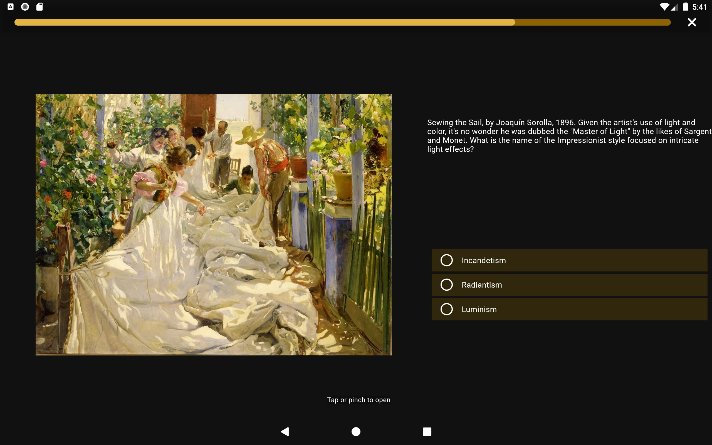
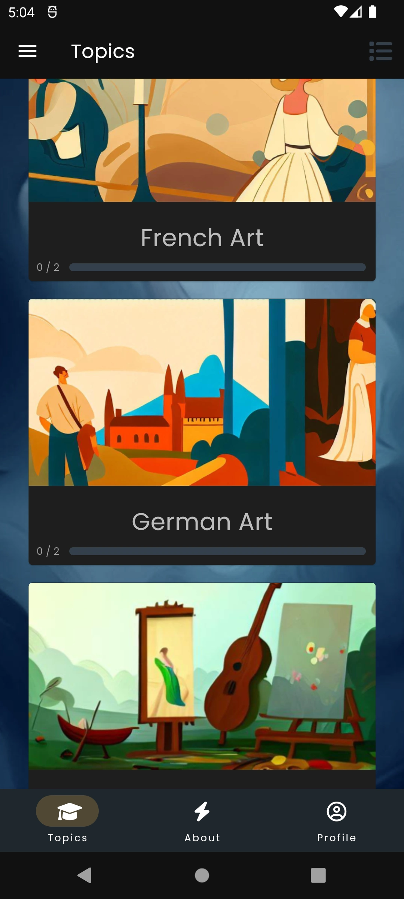
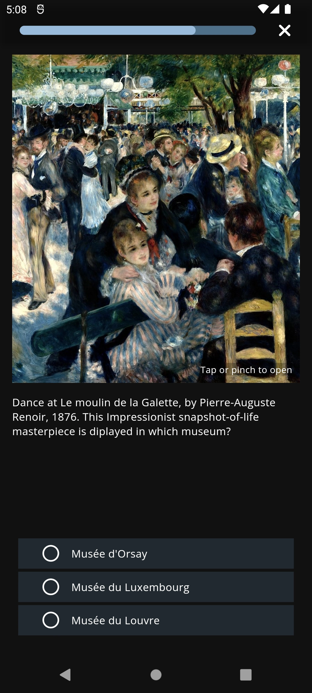
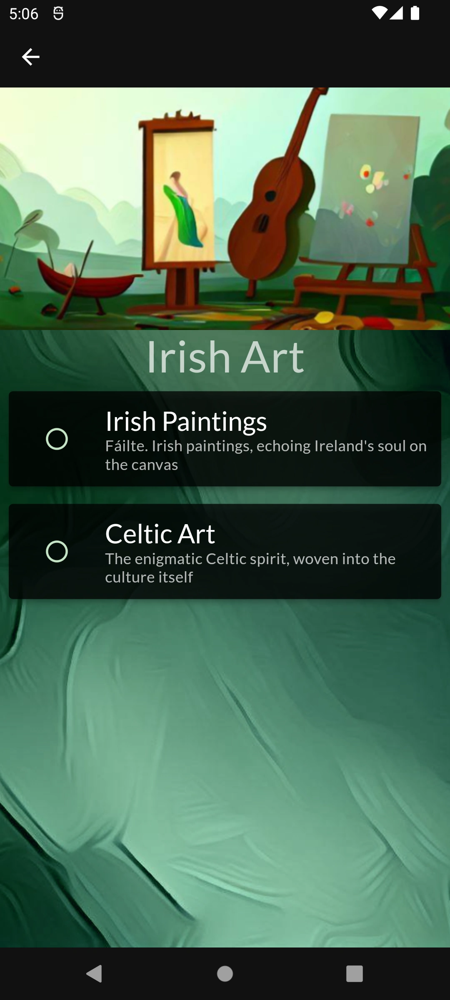

# quizz_app

This project was mainly created to learn about Firebase integration in Flutter, including using code generation with json_serializable to generate serialization-deserialization boilerplate from user defined data model classes, as well as to understand the design and layout of the UI in Flutter. This includes adaptive layouts (switching layouts for orientation changes) and responsive design (for instance, by using the Wrap widget or dynamic font size).

## [try on Google Play](https://play.google.com/store/apps/details?id=com.groznee.quizz_app)

 

  

